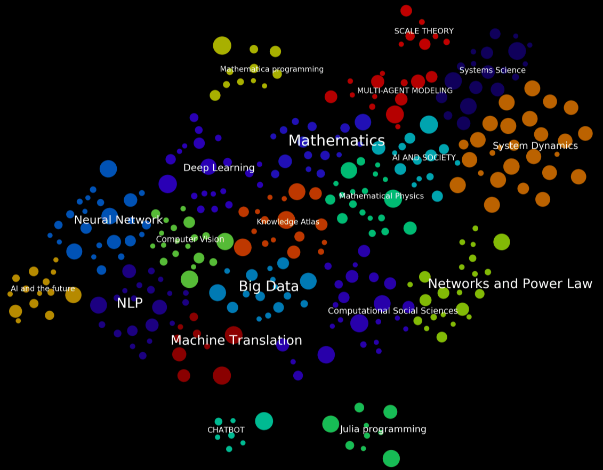

# Courses knowledge star-sky
## What is knowledge star-sky?
**Have a look for the courses knowledge star-sky!**

The dots in the image represent the courses in our website. The colors represents clustered categories. The size of the dots means the number of people paticipate in the program, which means the bigger dot represents more people take in this course. 

The colors represent clustered categories. Courses of similar type are grouped into one category.

## Something interesting of this work

All the courses are displayed in the two-dimensional map, the information displayed is more multi-dimensional and richer.

1. You can have a look for the relationship between different courses and different categories. For example, NLP is near to the Machine Translation.(**Algorithm automatically generated this, which is the same as the real relationship between them.**)

2. The distance between different categories means the gaps between courses in different areas.

3. You may find a learning road, I mean, when you study a course in Deep Learning category, you may find a course in the boundries of Computer Vision and Deep Learning. So you can cross the gap between different categories.

## Algorithms Details

###  1. Chinese Word Segmentation

Using tf-idf(jieba Module) to extract keywords.
constructing the knowledge structure based on text data of our courses.

###  2. Text embeddings and evolution 

used BOW, Word2Vec to embed the text into vectors, built courses text similarity matrix, used k-means to cluster the similar courses, used T-sne+ to lower down dimension and evolute the knowledge sky.

### 3. Force-directed layout

Realized repulsive force to arrange the layout, adding the clearity of knowledge map in 2-D.

click here for a clip on Youtube: https://www.youtube.com/watch?v=XgoLyWtQG2Y

